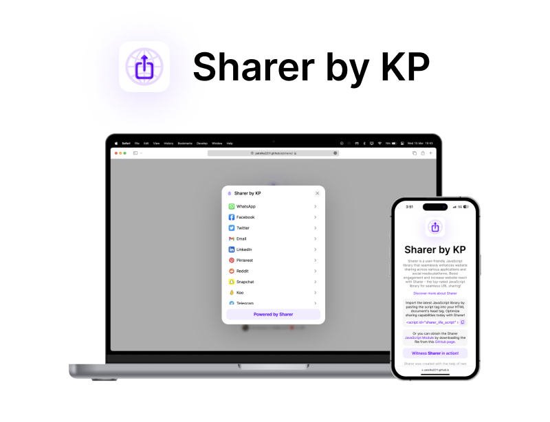
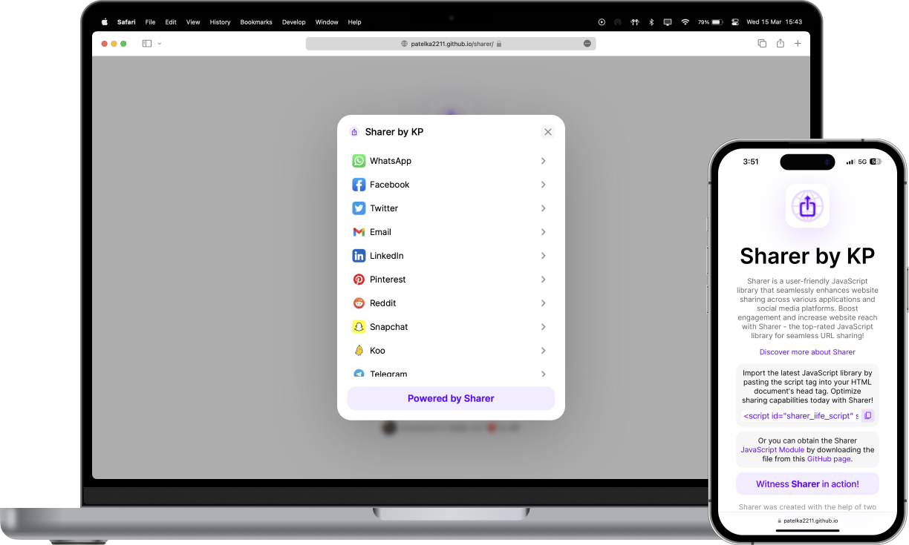

# Sharer by KP

<!--  -->



# 📝 Description

Sharer is a user-friendly JavaScript library that seamlessly enhances website sharing across various applications and social media platforms. Boost engagement and increase website reach with Sharer - the top-rated JavaScript library for seamless URL sharing!

# 📚 Usage

| Provided files                                                                                                             | File location                                                                               |
| -------------------------------------------------------------------------------------------------------------------------- | ------------------------------------------------------------------------------------------- |
| Sharer [IIFE](https://developer.mozilla.org/en-US/docs/Glossary/IIFE) file (It can be directly imported into your website) | [sharer.iife.js](https://github.com/patelka2211/sharer/tree/main/bundle/sharer.iife.js)     |
| Sharer [ESM](https://developer.mozilla.org/en-US/docs/Web/JavaScript/Guide/Modules) file (To use Sharer in your project)   | [sharer.esm.js](https://github.com/patelka2211/sharer/tree/main/bundle/sharer.esm.js)       |
| Sharer button ( to offer convenient sharing options with Sharer button!)                                                   | [sharer_button.js](https://github.com/patelka2211/sharer/tree/main/bundle/sharer_button.js) |

-   Both Sharer IIFE and ESM files provide a total of 6 functions.

| Function Name  | Method chaining supported | Parameters       | Description                                                                                     |
| -------------- | ------------------------- | ---------------- | ----------------------------------------------------------------------------------------------- |
| setURL         | Yes                       | `url`: `String`  | To share a customized URL using the Sharer (`default URL` is the `current URL of the page`)     |
| setDefaultURL  | Yes                       | none             | To `assign the URL variable` of the Sharer feature to the `current URL of the page`             |
| setText        | Yes                       | `text`: `String` | To share a customized text using the Sharer (`default text` is the `current title of the page`) |
| setDefaultText | Yes                       | none             | To `assign the text variable` of the Sharer feature to the `current title of the page`          |
| open           | No                        | none             | To open the Sharer                                                                              |
| close          | No                        | none             | To close the Sharer                                                                             |

# 💡 Examples

-   If you want to share a customized URL and text, such as sharing information about "ChatGPT," you can use the following code to set the URL and text of "ChatGPT" for sharing.

```js
sharer.setURl("https://chat.openai.com/").setText("ChatGPT").open();
```

-   If you want to set URL and text to default, you can use the following code.

`NOTE: By default, the URL and text values are automatically set to the URL and title of the current page, respectively.`

```js
sharer.setDefaultURL().setDefaultText().open();
```

# 📄 License

-   This project is licensed under the [MIT License](./LICENSE)
-   The MIT License permits the following actions:
    -   Use the software
    -   Copy the software
    -   Modify the software
    -   Merge the software with other software
    -   Publish the software
    -   Distribute the software
    -   Sublicense the software
-   The permitted actions are subject to the conditions stated in the [LICENSE file](./LICENSE).

# 🙌🏻 Credits

I would like to acknowledge and give credit to the creator of "[qrcode-svg](https://github.com/datalog/qrcode-svg/)", [@datalog](https://github.com/datalog/), for providing the library that enabled me to create SVG QR codes for Sharer, significantly enhancing its functionality and user experience. Furthermore, I would like to invite you to check out my other project, "[JSON2HTML](https://github.com/patelka2211/json2html/)", which was also utilized in the creation of Sharer.
